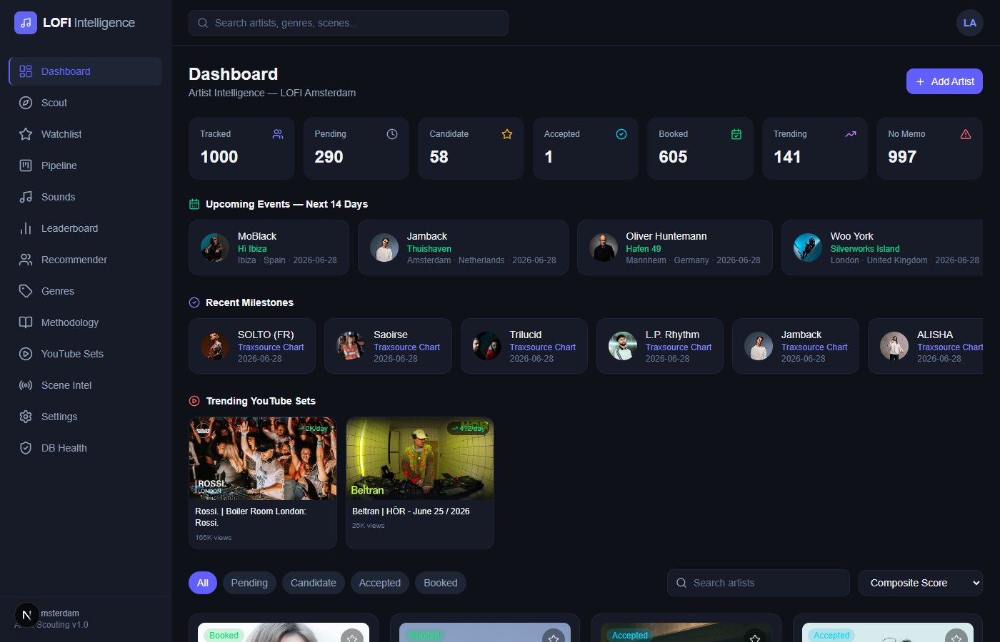
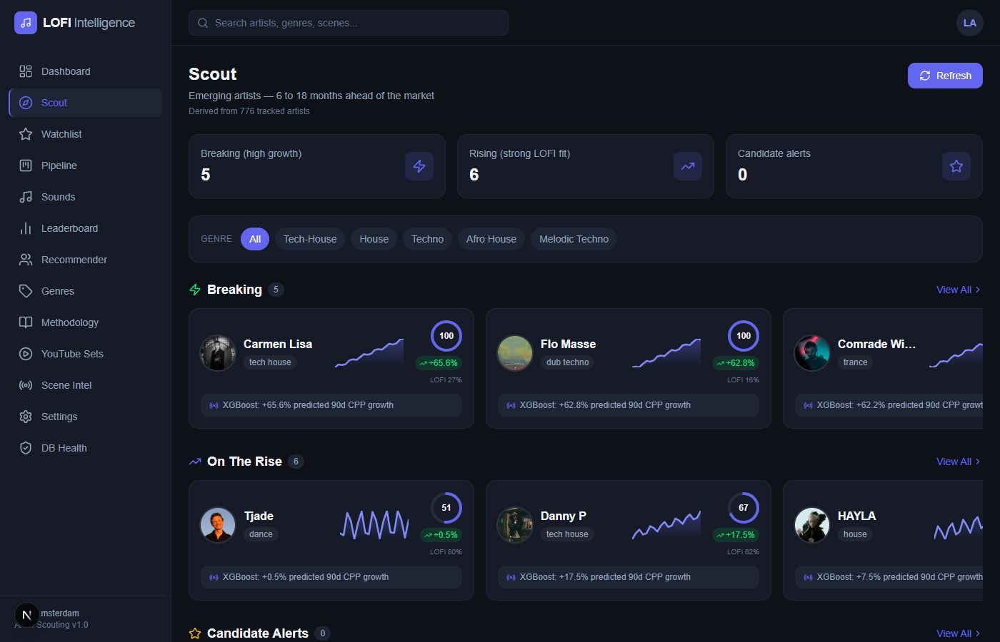
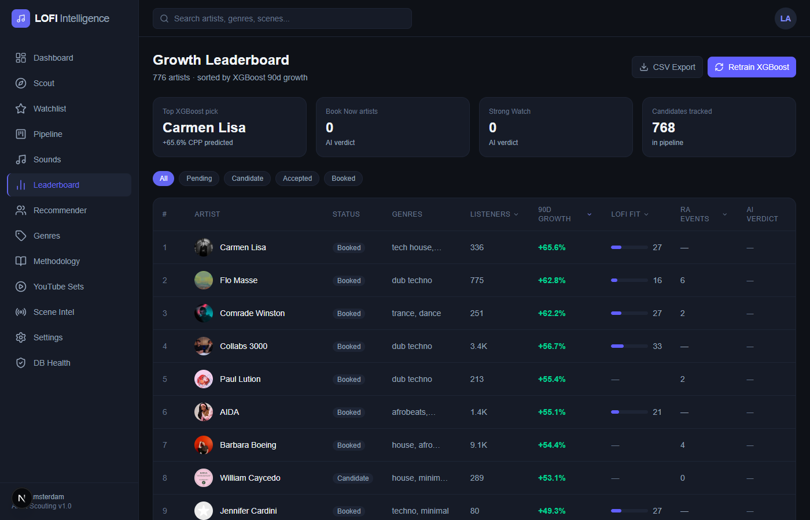
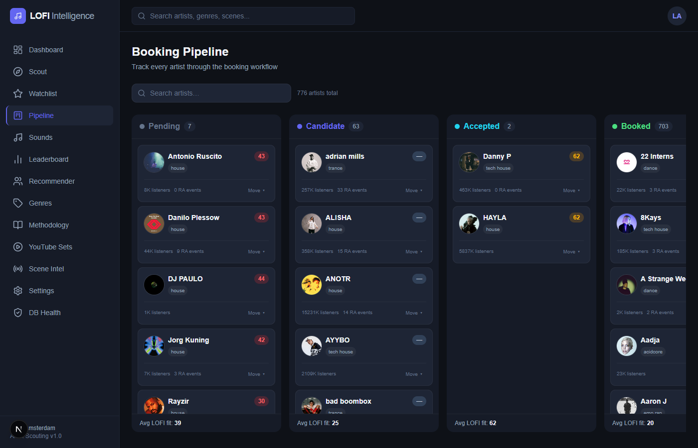
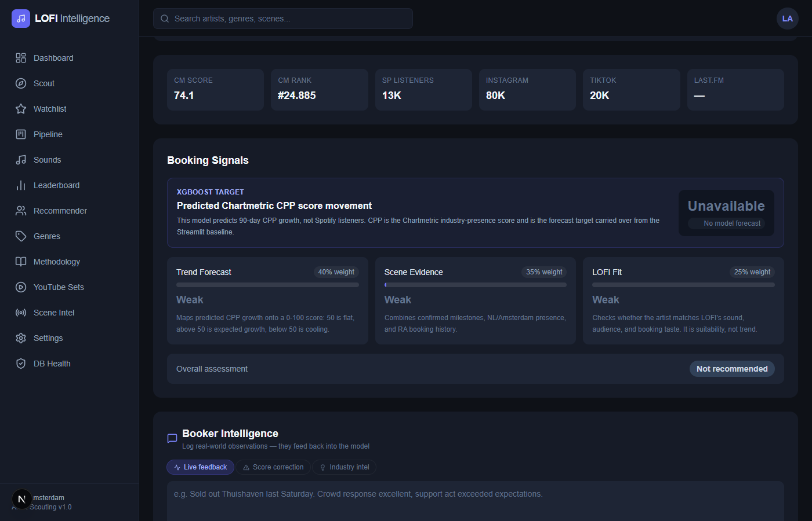

# LOFI Artist Intelligence

Internal booking intelligence platform for **LOFI Amsterdam**. Surfaces emerging electronic artists 6–18 months before the wider market and evaluates established artists before booking decisions.

## What it does

Every tracked artist receives five scores derived from Chartmetric, Resident Advisor, Partyflock, Last.fm, and YouTube data:

| Score | Signal |
|---|---|
| **Momentum** | 30-day Spotify growth, cross-platform acceleration |
| **Growth** | Rate of acceleration (second derivative of listeners) |
| **Market Relevance** | Audience size, CM rank, fan base rank |
| **Future Potential** | 6-month outlook via XGBoost + CPP trend |
| **Confidence** | Data coverage (13 fields) |

A composite LOFI Fit score blends these with scene signals (NL venue presence, RA event volume, validation events like Boiler Room / Ibiza).

An AI booking memo (on-demand, not auto-generated) gives a structured verdict: **Book Now / Strong Watch / Monitor / Pass**.

## Screenshots

**Dashboard** — upcoming events, recent milestones, trending YouTube sets, artist grid


**Scout** — breaking artists by XGBoost CPP growth, genre swim-lanes


**Growth Leaderboard** — sortable table with 90d XGBoost growth, LOFI fit, RA events


**Booking Pipeline** — Kanban from Pending → Candidate → Accepted → Booked


**Artist Profile** — platform stats, bio, booking signals breakdown, booker intelligence


## Repo structure

```
lofi-web/          Next.js 14 dashboard (deployed on Vercel)
scrapers/          Data ingestion — Chartmetric, RA, Partyflock, Last.fm, Beatport, Traxsource
scoring/           Python scoring engine (five_scores.py) + YAML genre framework
ml/                XGBoost breakout prediction model
tools/             One-off admin/audit scripts
docs/              Design docs and migration plans
lofi_pipeline.py   Main nightly pipeline entrypoint
export_chart_data.py  Exports chart data for ML feature building
```

## Dashboard pages

| Route | Purpose |
|---|---|
| `/dashboard` | Artist grid with search, filters, upcoming events, milestones |
| `/scout` | Breaking artists by XGBoost growth + LOFI fit swim-lanes |
| `/insights` | Growth leaderboard — sortable table of all tracked artists |
| `/pipeline` | Kanban board: Pending → Candidate → Accepted → Booked |
| `/watchlist` | Monitor groups with Chartmetric rescrape on configurable interval |
| `/recommendations` | Co-lineup recommender (finds artists sharing RA lineups) |
| `/scene` | Genre intelligence — bar, scatter, table views |
| `/sounds` | LOFI Sound Framework — artist tiers per genre |
| `/admin` | DB health, coverage gaps, exclusion log |
| `/artist/[id]` | Full artist profile with scores, growth chart, events, AI memo |

## Stack

| Layer | Choice |
|---|---|
| Frontend | Next.js 14 App Router (TypeScript), deployed on Vercel |
| Database | Supabase Postgres (`tinder` schema) |
| Scoring | Python `scoring/five_scores.py` + TypeScript mirror for on-demand refresh |
| ML | XGBoost (breakout prediction), predictions stored in `xgboost_predictions` |
| Data sources | Chartmetric API, Resident Advisor, Partyflock, Last.fm, Beatport, Traxsource |
| AI memos | Claude (Anthropic) — triggered manually per artist |

## Local development

```bash
# Web dashboard
cd lofi-web
cp .env.local.example .env.local
# fill in SUPABASE_URL, SUPABASE_SERVICE_KEY, ANTHROPIC_API_KEY, CHARTMETRIC_REFRESH_TOKEN
npm install
npm run dev
```

```bash
# Python pipeline
pip install -r requirements.txt
cp .env.example .env
# fill in SUPABASE_URL, SUPABASE_SERVICE_KEY, CHARTMETRIC_REFRESH_TOKEN, LASTFM_API_KEY
python lofi_pipeline.py
```

## Environment variables

| Variable | Purpose |
|---|---|
| `NEXT_PUBLIC_SUPABASE_URL` | Supabase project URL |
| `NEXT_PUBLIC_SUPABASE_ANON_KEY` | Supabase anon key (client-side) |
| `SUPABASE_SERVICE_KEY` | Service role key (server-side, bypasses RLS) |
| `ANTHROPIC_API_KEY` | Claude API key for AI booking memos |
| `CHARTMETRIC_REFRESH_TOKEN` | Chartmetric API refresh token |
| `LASTFM_API_KEY` | Last.fm API key |

## Scoring pipeline

Five scores are computed in `scoring/five_scores.py` and mirrored in `lofi-web/app/api/artists/[id]/refresh/route.ts`. The TypeScript version runs when "Refresh Scores" is clicked on an artist profile; the Python version runs nightly via the pipeline.

Both use the same tanh logistic mapping: `score = clamp(50 + 50 * tanh(pct / scale))`, same weights, and the same 13-field confidence calculation.

## Data freshness

- Chartmetric: nightly pipeline or on-demand rescrape from the Watchlist page
- RA events: `scrapers/scrape_ra_events.py` → `ra_events` table
- Partyflock: `scrapers/scrape_partyflock.py` → `artist_partyflock` table
- XGBoost predictions: `export_chart_data.py` → `ml/train_growth_model.py` → `xgboost_predictions` table

## AI memo

The booking memo is **not generated automatically**. It must be triggered from the artist profile page to avoid unnecessary API usage. The memo uses Chartmetric CPP forecast, RA event history, validation events, and booker notes as structured context.
